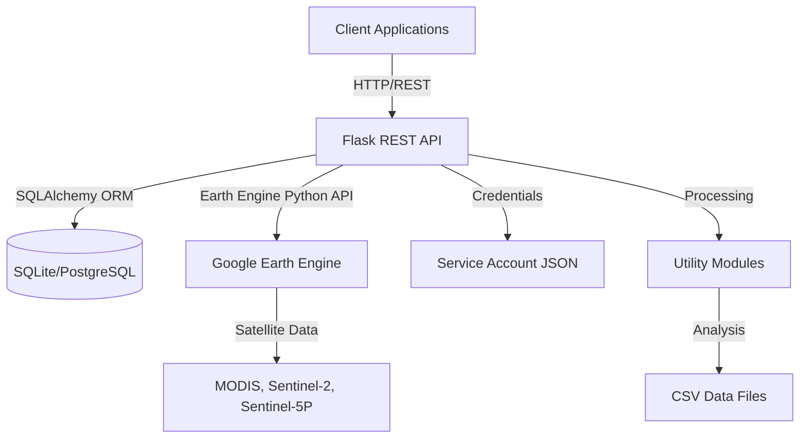
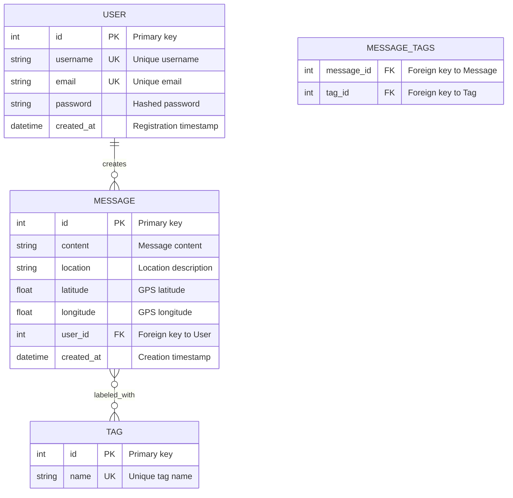
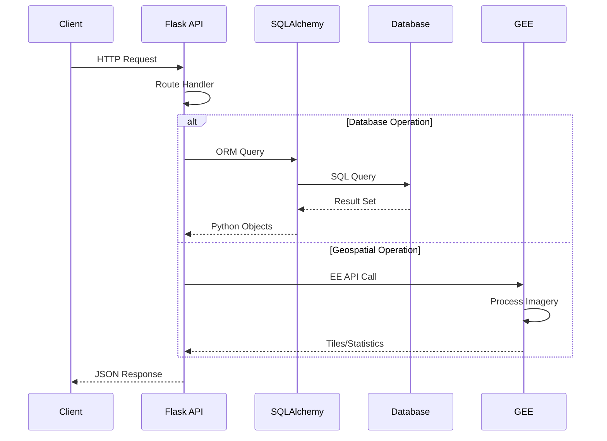

# Green Growth Backend – Technical Documentation

**Version:** 2.0  
**Last Updated:** October 12, 2025  
**Status:** Production Ready

This document provides a comprehensive, technical overview of the Green Growth backend repository. It consolidates installation guidance, code structure, datasets and data sources, API specifications, security considerations, and visual explanations to support onboarding, maintenance, and extension.

---

## Table of Contents

1. [Project Overview](#1-project-overview)
2. [Installation and Setup](#2-installation-and-setup)
3. [Repository Structure](#3-repository-structure)
4. [Architecture and Components](#4-architecture-and-components)
5. [API Surface](#5-api-surface)
6. [Datasets and Data Sources](#6-datasets-and-data-sources)
7. [Simulation Presets](#7-simulation-presets)
8. [Security and Configuration](#8-security-and-configuration)
9. [Error Handling and Best Practices](#9-error-handling-and-best-practices)
10. [Maintenance and Future Work](#10-maintenance-and-future-work)
11. [References](#11-references)

---

## 1. Project Overview

Green Growth Backend is a Flask-based RESTful API designed for urban planning and environmental monitoring. The system manages users and messages while integrating with Google Earth Engine (GEE) for advanced geospatial analysis and environmental simulations.

### Core Capabilities

**User & Message Management:**
- User registration, authentication (login/logout), and profile management
- Create, read, update, and delete user-generated messages with geo-coordinates and tags
- Query messages by location, tags, and user associations
- Track user activity and message history

**Geospatial Analysis & Visualization:**
- Retrieve imagery tiles for environmental layers (Land Surface Temperature, NDVI, Air Quality) from GEE
- Generate statistics and metrics for specified geographic regions
- Run "what-if" simulations applying environmental presets (green areas, industrial zones, residential areas)
- Compute impact deltas and environmental changes
- Support for custom geometry definitions

**Key Technologies:**
- **Backend Framework:** Flask 3.1.2 with Flask-CORS 6.0.1
- **ORM:** SQLAlchemy 3.1.1
- **Geospatial:** Google Earth Engine API 1.6.10, geemap 0.36.4
- **Visualization:** Folium 0.20.0, ipyleaflet 0.20.0
- **Data Processing:** pandas, numpy, matplotlib
- **Containerization:** Docker with Docker Compose
- **Database:** SQLite (development) / PostgreSQL (production-ready)

---

## 2. Installation and Setup

### Prerequisites

- Python 3.11+
- Docker and Docker Compose (optional, for containerized deployment)
- Google Cloud Platform account with Earth Engine enabled
- Git

### Quick Start (Development)

1. **Clone the repository**
   ```bash
   git clone <repository-url>
   cd backend
   ```

2. **Create Python virtual environment**
   ```bash
   python -m venv venv
   source venv/bin/activate  # On Windows: venv\Scripts\activate
   ```

3. **Install dependencies**
   ```bash
   pip install -r requirements.txt
   ```

4. **Set up environment variables**
   
   Copy the template and configure:
   ```bash
   cp .flaskenv.template .flaskenv
   ```
   
   Edit `.flaskenv` with your settings:
   ```bash
   FLASK_APP=app.py
   FLASK_ENV=development
   DB_URL=sqlite:///instance/greengrowth.db
   GEE_PROJECT=your-gee-project-id
   GOOGLE_APPLICATION_CREDENTIALS=./secrets/your-service-account.json
   ```

5. **Initialize the database**
   ```bash
   flask --app app.py init-db
   ```

6. **Run the application**
   ```bash
   flask run
   ```
   
   The API will be available at `http://localhost:5000`

### Docker Deployment

1. **Build and run with Docker Compose**
   ```bash
   docker-compose up --build
   ```
   
   The API will be available at `http://localhost:5001`

2. **Initialize database in container**
   ```bash
   docker-compose exec backend flask --app app.py init-db
   ```

### Environment Variables Reference

| Variable | Description | Example |
|----------|-------------|---------|
| `FLASK_APP` | Entry point for Flask application | `app.py` |
| `FLASK_ENV` | Environment mode | `development` or `production` |
| `DB_URL` | Database connection string | `sqlite:///instance/greengrowth.db` |
| `GEE_PROJECT` | Google Earth Engine project ID | `greengrowth-474117` |
| `GOOGLE_APPLICATION_CREDENTIALS` | Path to GCP service account JSON | `./secrets/credentials.json` |

---

## 3. Repository Structure

```
backend/
├── app.py                       # Flask app setup, CORS, blueprints, CLI commands
├── models/                      # SQLAlchemy models and database instance
│   ├── __init__.py              # db = SQLAlchemy(), exports Message, Tag, User
│   ├── MessageModel.py          # Message model + message_tags association table
│   ├── TagModel.py              # Tag model + helper methods
│   └── UserModel.py             # User model + relationships to messages
├── routers/                     # API blueprints (route handlers)
│   ├── __init__.py              # Exposes message_bp, user_bp, geo_bp
│   ├── message_router.py        # CRUD for messages, queries by tag/location
│   ├── user_router.py           # User registration, auth, CRUD operations
│   └── geo_router.py            # GEE tiles, statistics, simulations
├── utils/                       # Utility modules
│   ├── __init__.py              # Exposes GeoProcessor and other utilities
│   ├── geoprocessor.py          # GEE integration and simulations
│   ├── industry.py              # Industry-specific analysis
│   └── wind.py                  # Wind data processing
├── data/                        # Data files and exports
│   ├── export_facility_wind_data.csv
│   └── ghg_data_with_lst.csv
├── docs/                        # Documentation
│   └── GreenGrowth_Backend_Documentation.md
├── secrets/                     # Google Cloud credentials (git-ignored)
│   └── greengrowth-474117-*.json
├── instance/                    # SQLite database files (auto-generated)
├── Dockerfile                   # Container image definition
├── docker-compose.yml           # Service orchestration
├── requirements.txt             # Python dependencies
├── .flaskenv.template           # Environment variable template
└── README.md                    # Project readme
```

---

## 4. Architecture and Components

### 4.1 High-Level Architecture



### 4.2 Data Model (ER Diagram)



### 4.3 Request Flow



---

## 5. API Surface

Base URL (development): `http://localhost:5000`  
Base URL (Docker): `http://localhost:5001`

### 5.1 Users API (`/users`)

#### Register New User
```http
POST /users/register
Content-Type: application/json

{
  "username": "johndoe",
  "email": "john@example.com",
  "password": "securepassword123"
}
```

**Response (201 Created):**
```json
{
  "status": "success",
  "message": "User johndoe registered successfully",
  "payload": {
    "id": 1,
    "username": "johndoe",
    "email": "john@example.com"
  }
}
```

**Error Cases:**
- `400 Bad Request`: Missing request body
- `409 Conflict`: Username or email already exists
- `500 Internal Server Error`: Database error

---

#### User Login
```http
POST /users/login
Content-Type: application/json

{
  "username": "johndoe",
  "password": "securepassword123"
}
```

**Response (200 OK):**
```json
{
  "status": "success",
  "message": "User johndoe logged in successfully",
  "payload": {
    "id": 1,
    "username": "johndoe",
    "email": "john@example.com"
  }
}
```

**Error Cases:**
- `400 Bad Request`: Missing request body
- `401 Unauthorized`: Invalid username or password
- `500 Internal Server Error`: Database error

---

#### User Logout
```http
POST /users/<user_id>/logout
```

**Response (200 OK):**
```json
{
  "status": "success",
  "message": "User logged out successfully",
  "payload": null
}
```

---

#### Get All Users
```http
GET /users/
```

**Response (200 OK):**
```json
{
  "status": "success",
  "message": "Users retrieved successfully",
  "payload": [
    {
      "id": 1,
      "username": "johndoe",
      "email": "john@example.com"
    },
    {
      "id": 2,
      "username": "janedoe",
      "email": "jane@example.com"
    }
  ]
}
```

---

#### Get User by ID
```http
GET /users/<user_id>
```

**Response (200 OK):**
```json
{
  "status": "success",
  "message": "User retrieved successfully",
  "payload": {
    "id": 1,
    "username": "johndoe",
    "email": "john@example.com"
  }
}
```

**Error Cases:**
- `404 Not Found`: User does not exist
- `500 Internal Server Error`: Database error

---

#### Update User
```http
PUT /users/<user_id>
Content-Type: application/json

{
  "email": "newemail@example.com",
  "password": "newpassword123"
}
```

**Response (200 OK):**
```json
{
  "status": "success",
  "message": "User with id 1 updated successfully",
  "payload": {
    "id": 1,
    "username": "johndoe",
    "email": "newemail@example.com"
  }
}
```

**Error Cases:**
- `404 Not Found`: User does not exist
- `500 Internal Server Error`: Database error

---

#### Delete User
```http
DELETE /users/<user_id>
```

**Response (200 OK):**
```json
{
  "status": "success",
  "message": "User with id 1 deleted successfully",
  "payload": null
}
```

**Error Cases:**
- `404 Not Found`: User does not exist
- `500 Internal Server Error`: Database error

---

#### Get User Messages
```http
GET /users/messages/<user_id>/
```

**Response (200 OK):**
```json
{
  "status": "success",
  "message": "Messages retrieved successfully",
  "payload": [
    {
      "id": 1,
      "content": "New park proposed for downtown area",
      "tags": ["Infraestructura", "Servicios Publicos"]
    },
    {
      "id": 2,
      "content": "Traffic light needed at intersection",
      "tags": ["Seguridad", "Movibilidad"]
    }
  ]
}
```

---

### 5.2 Messages API (`/messages`)

#### Create Message
```http
POST /messages/
Content-Type: application/json

{
  "content": "New park proposed for downtown area",
  "location": "Downtown Central",
  "latitude": 40.7128,
  "longitude": -74.0060,
  "user_id": 1,
  "tags": ["Infraestructura", "Servicios Publicos"]
}
```

**Response (201 Created):**
```json
{
  "status": "success",
  "message": "Message created successfully",
  "payload": {
    "id": 1,
    "content": "New park proposed for downtown area",
    "location": "Downtown Central",
    "latitude": 40.7128,
    "longitude": -74.0060,
    "user_id": 1,
    "tags": ["Infraestructura", "Servicios Publicos"]
  }
}
```

---

#### Get All Messages
```http
GET /messages/
```

**Response (200 OK):**
```json
{
  "status": "success",
  "message": "Messages retrieved successfully",
  "payload": [
    {
      "id": 1,
      "content": "New park proposed",
      "location": "Downtown",
      "latitude": 40.7128,
      "longitude": -74.0060,
      "tags": ["Infraestructura"]
    }
  ]
}
```

---

#### Get Message by ID
```http
GET /messages/<message_id>
```

---

#### Update Message
```http
PUT /messages/<message_id>
Content-Type: application/json

{
  "content": "Updated message content",
  "tags": ["Seguridad"]
}
```

---

#### Delete Message
```http
DELETE /messages/<message_id>
```

---

#### Get Messages by Location
```http
GET /messages/get-messages-by-location?location=Downtown
```

**Response (200 OK):**
```json
{
  "status": "success",
  "message": "Messages retrieved successfully",
  "payload": [...]
}
```

---

#### Get Messages by Tags
```http
GET /messages/get-messages-by-tag?tags=Infraestructura,Seguridad&match=any
```

**Query Parameters:**
- `tags`: Comma-separated list of tag names
- `match`: `any` (OR logic) or `all` (AND logic)

**Response (200 OK):**
```json
{
  "status": "success",
  "message": "Messages retrieved successfully",
  "payload": [...]
}
```

---

### 5.3 Geospatial API (`/geo`)

#### Get Initial Layer Data (Tiles)
```http
GET /geo/get-initial-data/<layer_name>
```

**Supported Layers:**
- `temp` - Land Surface Temperature
- `ndvi` - Normalized Difference Vegetation Index
- `aq` - Air Quality Composite

**Response (200 OK):**
```json
{
  "status": "success",
  "message": "Tile URL retrieved successfully",
  "payload": {
    "tile_url": "https://earthengine.googleapis.com/v1/projects/.../tiles/..."
  }
}
```

---

#### Run Simulation (Statistics)
```http
GET /geo/simulate?latitude=40.7128&longitude=-74.0060&buffer=1000&preset=green_area&geometry=...
```

**Query Parameters:**
- `latitude`: Center latitude (required)
- `longitude`: Center longitude (required)
- `buffer`: Buffer radius in meters (required)
- `preset`: Simulation preset (`green_area`, `industrial`, `residential`) (required)
- `geometry`: Custom geometry definition (optional)

**Response (200 OK):**
```json
{
  "status": "success",
  "message": "Simulation completed successfully",
  "payload": {
    "baseline": {
      "temperature": 25.3,
      "ndvi": 0.45,
      "air_quality": 65.2
    },
    "simulated": {
      "temperature": 20.3,
      "ndvi": 0.70,
      "air_quality": 55.2
    },
    "delta": {
      "temperature": -5.0,
      "ndvi": 0.25,
      "air_quality": -10.0
    }
  }
}
```

---

#### Generate Simulation Tiles
```http
POST /geo/simulate-tiles?latitude=40.7128&longitude=-74.0060&buffer=1000&preset=green_area&geometry=...
```

**Response (200 OK):**
```json
{
  "status": "success",
  "message": "Simulated tiles generated successfully",
  "payload": {
    "temp_tile_url": "https://...",
    "ndvi_tile_url": "https://...",
    "aq_tile_url": "https://..."
  }
}
```

---

## 6. Datasets and Data Sources

The backend integrates with multiple public datasets via Google Earth Engine:

### 6.1 Land Surface Temperature (LST)

**Dataset:** `MODIS/061/MOD11A1`  
**Band:** `LST_Day_1km`  
**Processing:**
- Scale factor: 0.02
- Conversion: Kelvin to Celsius (−273.15)
- Temporal resolution: Daily
- Spatial resolution: 1 km

**Reference:** [MODIS LST Documentation](https://developers.google.com/earth-engine/datasets/catalog/MODIS_061_MOD11A1)

**Example Usage:**
```python
dataset = ee.ImageCollection('MODIS/061/MOD11A1') \
    .filterDate('2024-01-01', '2024-01-31') \
    .select('LST_Day_1km')
temp_celsius = dataset.mean().multiply(0.02).subtract(273.15)
```

---

### 6.2 Normalized Difference Vegetation Index (NDVI)

**Dataset:** `COPERNICUS/S2_SR_HARMONIZED`  
**Computation:** `(B8 - B4) / (B8 + B4)`  
**Cloud Filtering:** `CLOUDY_PIXEL_PERCENTAGE < 10`  
**Temporal resolution:** ~5 days (revisit time)  
**Spatial resolution:** 10 m

**Reference:** [Sentinel-2 SR Harmonized Documentation](https://developers.google.com/earth-engine/datasets/catalog/COPERNICUS_S2_SR_HARMONIZED)

**Example Usage:**
```python
dataset = ee.ImageCollection('COPERNICUS/S2_SR_HARMONIZED') \
    .filterDate('2024-01-01', '2024-01-31') \
    .filter(ee.Filter.lt('CLOUDY_PIXEL_PERCENTAGE', 10))
ndvi = dataset.map(lambda img: img.normalizedDifference(['B8', 'B4']))
```

---

### 6.3 Air Quality Composite

**Composite from 5 Sentinel-5P Products:**

| Component | Dataset | Band | Unit |
|-----------|---------|------|------|
| NO₂ | `COPERNICUS/S5P/NRTI/L3_NO2` | `NO2_column_number_density` | mol/m² |
| SO₂ | `COPERNICUS/S5P/NRTI/L3_SO2` | `SO2_column_number_density` | mol/m² |
| O₃ | `COPERNICUS/S5P/NRTI/L3_O3` | `O3_column_number_density` | mol/m² |
| CO | `COPERNICUS/S5P/NRTI/L3_CO` | `CO_column_number_density` | mol/m² |
| Aerosol | `COPERNICUS/S5P/NRTI/L3_AER_AI` | `absorbing_aerosol_index` | unitless |

**Processing:**
1. Each band is normalized to 0–100 scale
2. All normalized bands are averaged
3. Result: `AQ_Composite_0_100` (higher = worse air quality)

**Temporal resolution:** Daily  
**Spatial resolution:** 7 km × 3.5 km

**References:**
- [Sentinel-5P NO₂](https://developers.google.com/earth-engine/datasets/catalog/COPERNICUS_S5P_NRTI_L3_NO2)
- [Sentinel-5P SO₂](https://developers.google.com/earth-engine/datasets/catalog/COPERNICUS_S5P_NRTI_L3_SO2)
- [Sentinel-5P O₃](https://developers.google.com/earth-engine/datasets/catalog/COPERNICUS_S5P_NRTI_L3_O3)
- [Sentinel-5P CO](https://developers.google.com/earth-engine/datasets/catalog/COPERNICUS_S5P_NRTI_L3_CO)
- [Sentinel-5P Aerosol](https://developers.google.com/earth-engine/datasets/catalog/COPERNICUS_S5P_NRTI_L3_AER_AI)

---

### 6.4 Local Data Files

**GHG Data with LST:** `data/ghg_data_with_lst.csv`
- Greenhouse gas emissions data
- Merged with land surface temperature
- Used for industry-specific analysis

**Facility Wind Data:** `data/export_facility_wind_data.csv`
- Wind patterns and facility locations
- Used for environmental impact assessments

---

## 7. Simulation Presets

Defined in `utils/geoprocessor.py` → `GeoProcessor._create_simulated_images()`

### 7.1 Green Area Preset

**Environmental Impact:**
- Temperature: **−5°C**
- NDVI: **→ 0.70** (healthy vegetation)
- Air Quality: **−10 points** (improvement)

**Use Cases:**
- Urban parks
- Green roofs
- Tree planting initiatives
- Urban reforestation

---

### 7.2 Industrial Preset

**Environmental Impact:**
- Temperature: **+8°C**
- NDVI: **→ 0.05** (minimal vegetation)
- Air Quality: **+40 points** (degradation)

**Use Cases:**
- Industrial zones
- Manufacturing facilities
- Heavy industry areas
- Pollution impact studies

---

### 7.3 Residential Preset

**Environmental Impact:**
- Temperature: **+4°C**
- NDVI: **→ 0.15** (sparse vegetation)
- Air Quality: **+20 points** (moderate degradation)

**Use Cases:**
- Housing developments
- Urban sprawl analysis
- Suburban planning
- Mixed-use zones

---

### 7.4 Mask Application

All modifications are applied only within the user-provided geometry using a binary mask:
- Inside geometry: `mask = 1` (modifications applied)
- Outside geometry: `mask = 0` (baseline values preserved)

---

## 8. Security and Configuration

### 8.1 Authentication & Authorization

**Current Status:**
- Basic username/password authentication
- No encryption for passwords (⚠️ **Security Risk**)
- No session management
- No role-based access control (RBAC)

**Recommendations:**
- Implement password hashing (bcrypt, argon2)
- Add JWT-based authentication
- Implement refresh tokens
- Add role-based permissions
- Enable HTTPS in production

---

### 8.2 CORS Configuration

**Current:** Enabled for all origins (`*`)
```python
CORS(app, resources={r"/*": {"origins": "*"}})
```

**Production Recommendation:**
```python
CORS(app, resources={
    r"/*": {
        "origins": ["https://yourdomain.com"],
        "methods": ["GET", "POST", "PUT", "DELETE"],
        "allow_headers": ["Content-Type", "Authorization"]
    }
})
```

---

### 8.3 Credentials Management

**Google Earth Engine:**
- Service account JSON stored in `secrets/` directory
- Must be mounted read-only in Docker: `./secrets:/app/secrets:ro`
- **Never commit credentials to Git** (add to `.gitignore`)

**Database:**
- Use environment variables for connection strings
- Rotate credentials regularly
- Use connection pooling in production

---

### 8.4 Environment Variables Security

**Best Practices:**
- Never hardcode sensitive values
- Use `.env` files (git-ignored)
- Use secret management services (AWS Secrets Manager, Google Secret Manager)
- Validate all environment variables at startup

---

### 8.5 Input Validation

**Current Gaps:**
- No input sanitization
- No request size limits
- No rate limiting

**Recommendations:**
- Add request validation (marshmallow, pydantic)
- Implement rate limiting (Flask-Limiter)
- Sanitize user inputs
- Validate geometry inputs
- Add request size limits

---

## 9. Error Handling and Best Practices

### 9.1 Standard Response Format

All API endpoints follow a consistent response structure:

```json
{
  "status": "success|error",
  "message": "Human-readable message",
  "payload": {...}
}
```

---

### 9.2 HTTP Status Codes

| Code | Meaning | Usage |
|------|---------|-------|
| `200` | OK | Successful GET, PUT, DELETE |
| `201` | Created | Successful POST |
| `400` | Bad Request | Invalid input |
| `401` | Unauthorized | Authentication failure |
| `404` | Not Found | Resource doesn't exist |
| `409` | Conflict | Duplicate resource |
| `500` | Internal Server Error | Unexpected error |

---

### 9.3 Database Transaction Management

All database operations include proper error handling:

```python
try:
    # Database operation
    db.session.add(new_entity)
    db.session.commit()
    return success_response, 201
except Exception as e:
    db.session.rollback()
    return error_response, 500
```

---

### 9.4 Logging Best Practices

**Recommended Implementation:**
```python
import logging

logging.basicConfig(level=logging.INFO)
logger = logging.getLogger(__name__)

@user_bp.post("/register")
def register_user():
    logger.info(f"Registration attempt for user: {data['username']}")
    # ... rest of the code
```

---

## 10. Maintenance and Future Work

### 10.1 High Priority

- [ ] **Security Enhancements**
  - Implement password hashing (bcrypt/argon2)
  - Add JWT authentication
  - Enable HTTPS
  - Restrict CORS origins

- [ ] **Input Validation**
  - Add request validation schemas
  - Implement rate limiting
  - Add request size limits
  - Improve geometry parsing in `/geo/simulate-tiles`

- [ ] **Testing**
  - Add unit tests
  - Add integration tests
  - Add API endpoint tests
  - Set up CI/CD pipeline

---

### 10.2 Medium Priority

- [ ] **Database Improvements**
  - Add database indexes
  - Implement migrations (Alembic)
  - Add soft delete functionality
  - Implement audit logging

- [ ] **API Enhancements**
  - Add pagination for list endpoints
  - Implement filtering and sorting
  - Add search functionality
  - Parameterize date ranges for datasets

- [ ] **Documentation**
  - Add API documentation (Swagger/OpenAPI)
  - Create deployment guides
  - Add troubleshooting section
  - Create video tutorials

---

### 10.3 Low Priority

- [ ] **Features**
  - Add webhook support
  - Implement caching (Redis)
  - Add asynchronous task processing (Celery)
  - Create admin dashboard

- [ ] **Monitoring**
  - Add application monitoring (Prometheus)
  - Implement logging aggregation (ELK Stack)
  - Add performance metrics
  - Create health check endpoints

---

### 10.4 Known Issues

1. **Geometry Parsing in Simulate Tiles**
   - Current: `geometry = float(geometry_str)` (incorrect)
   - Fix: Parse GeoJSON/WKT properly

2. **Password Storage**
   - Current: Plain text (⚠️ **Critical Security Risk**)
   - Fix: Implement bcrypt hashing

3. **Date Range Hardcoding**
   - Current: Static date ranges in GEE queries
   - Fix: Make dates configurable via parameters

4. **Duplicate Endpoint Prevention**
   - Recent fix: Removed duplicate `login_user` endpoint
   - Monitor: Check for other duplicate routes

---

## 11. References

### Official Documentation

- **Flask:** https://flask.palletsprojects.com/
- **SQLAlchemy:** https://www.sqlalchemy.org/
- **Google Earth Engine Python API:** https://developers.google.com/earth-engine/guides/python_install

### Dataset References

- **Sentinel-2 SR Harmonized:** https://developers.google.com/earth-engine/datasets/catalog/COPERNICUS_S2_SR_HARMONIZED
- **MODIS LST Day 1km:** https://developers.google.com/earth-engine/datasets/catalog/MODIS_061_MOD11A1
- **Sentinel-5P NO₂:** https://developers.google.com/earth-engine/datasets/catalog/COPERNICUS_S5P_NRTI_L3_NO2
- **Sentinel-5P SO₂:** https://developers.google.com/earth-engine/datasets/catalog/COPERNICUS_S5P_NRTI_L3_SO2
- **Sentinel-5P O₃:** https://developers.google.com/earth-engine/datasets/catalog/COPERNICUS_S5P_NRTI_L3_O3
- **Sentinel-5P CO:** https://developers.google.com/earth-engine/datasets/catalog/COPERNICUS_S5P_NRTI_L3_CO
- **Sentinel-5P Aerosol:** https://developers.google.com/earth-engine/datasets/catalog/COPERNICUS_S5P_NRTI_L3_AER_AI

### Additional Resources

- **Docker Documentation:** https://docs.docker.com/
- **PostgreSQL Documentation:** https://www.postgresql.org/docs/
- **Python Best Practices:** https://realpython.com/
- **REST API Design:** https://restfulapi.net/

---

## Appendix A: Sample API Calls

### cURL Examples

**Register User:**
```bash
curl -X POST http://localhost:5000/users/register \
  -H "Content-Type: application/json" \
  -d '{"username":"johndoe","email":"john@example.com","password":"secret123"}'
```

**Login:**
```bash
curl -X POST http://localhost:5000/users/login \
  -H "Content-Type: application/json" \
  -d '{"username":"johndoe","password":"secret123"}'
```

**Create Message:**
```bash
curl -X POST http://localhost:5000/messages/ \
  -H "Content-Type: application/json" \
  -d '{
    "content":"New park proposal",
    "location":"Downtown",
    "latitude":40.7128,
    "longitude":-74.0060,
    "user_id":1,
    "tags":["Infraestructura"]
  }'
```

**Run Simulation:**
```bash
curl -X GET "http://localhost:5000/geo/simulate?latitude=40.7128&longitude=-74.0060&buffer=1000&preset=green_area"
```

---

## Appendix B: Default Tags

The system initializes with four default tags:

1. **Infraestructura** (Infrastructure)
2. **Seguridad** (Security)
3. **Movibilidad** (Mobility)
4. **Servicios Publicos** (Public Services)

Additional tags can be added via database operations.

---

**Document Version:** 2.0  
**Last Updated:** October 12, 2025  
**Maintained By:** Development Team  
**Repository:** [GitHub Repository Link]
