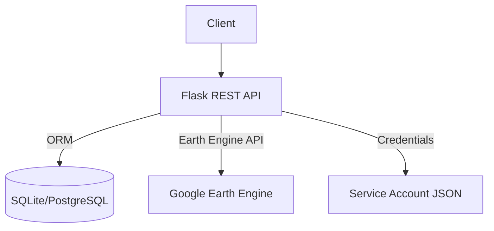
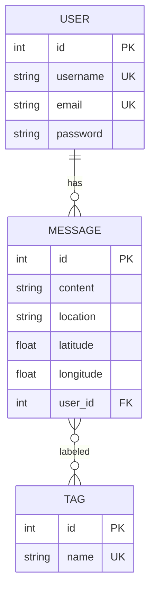
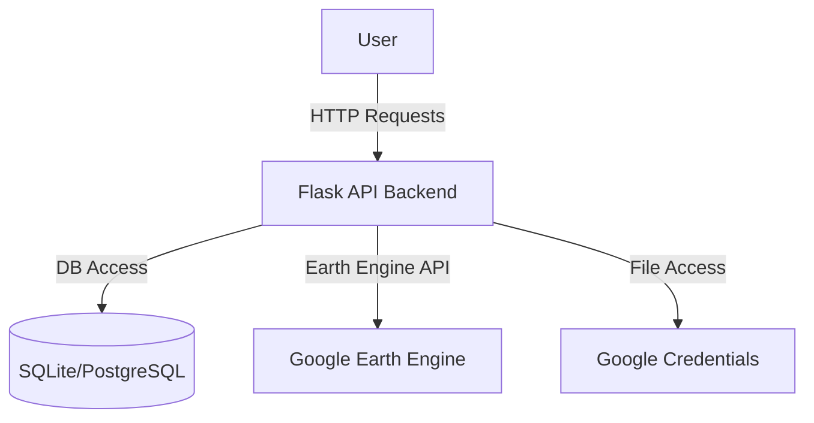

# Green Growth Backend – Technical Documentation

This document provides a comprehensive, theoretical overview of the Green Growth backend repository. It consolidates installation guidance, code structure, datasets and data sources, and visual explanations (diagrams and screenshots placeholders) to support onboarding, maintenance, and extension.

---

## 1. Project Overview

Green Growth Backend is a Flask-based RESTful API that manages users and messages, and integrates with Google Earth Engine (GEE) for geospatial analysis and simulations. It exposes endpoints to:

- Create, read, update, and delete user-generated messages with geo-coordinates and tags.
- Retrieve imagery tiles and compute statistics for environmental layers (temperature, NDVI, and air quality) from GEE.
- Run “what-if” simulations applying presets (e.g., green areas, industrial, residential) over custom geometries and compute impact deltas.

Key technologies: Flask, SQLAlchemy, Google Earth Engine, Docker.

---

## 2. Installation and Setup

Follow the quick start in the repository `README.md`. Summary:

1) Python environment
- Python 3.11+
- `pip install -r requirements.txt`

2) Environment variables
- Copy `.flaskenv.template` to `.flaskenv` and set:
	- `DB_URL`, `GEE_PROJECT`, `GOOGLE_APPLICATION_CREDENTIALS`, `FLASK_APP`, `FLASK_ENV`

3) Database initialization
- `flask --app app.py init-db`

4) Run
- `flask run` (http://localhost:5000) or `docker-compose up --build` (http://localhost:5001)

---

## 3. Repository Structure

```
backend/
├── app.py                 # Flask app setup, CORS, blueprints, init-db CLI
├── models/                # SQLAlchemy models and DB instance
│   ├── __init__.py        # db = SQLAlchemy(), re-exports Message, Tag, User
│   ├── MessageModel.py    # Message model + message_tags association table
│   ├── TagModel.py        # Tag model + helper to list tags
│   └── UserModel.py       # User model + relationship to messages
├── routers/               # API blueprints
│   ├── __init__.py        # Exposes message_bp, user_bp, geo_bp
│   ├── message_router.py  # CRUD for messages, queries by tag/location
│   ├── user_router.py     # Register, list, update, delete users; list messages
│   └── geo_router.py      # GEE tiles, stats, simulations
├── utils/
│   ├── __init__.py        # Exposes GeoProcessor
│   └── geoprocessor.py    # GEE integration and simulations
├── Dockerfile             # Container image
├── docker-compose.yml     # Service orchestration
├── requirements.txt       # Python dependencies
├── .flaskenv.template     # Env var template
└── secrets/               # Google credentials (mounted in Docker)
```

---

## 4. Architecture and Components

### 4.1 High-level architecture



### 4.2 Data model (ER Diagram)


---

## 5. API Surface

Base URL (development): `http://localhost:5000`

### 5.1 Users (`/users`)
- POST `/users/register` — create user
- GET `/users/` — list users
- PUT `/users/<user_id>` — update user
- DELETE `/users/<user_id>` — delete user
- GET `/users/messages/<user_id>/` — list user messages

### 5.2 Messages (`/messages`)
- POST `/messages/` — create message
- GET `/messages/` — list messages
- GET `/messages/<message_id>` — retrieve message
- PUT `/messages/<message_id>` — update message
- DELETE `/messages/<message_id>` — delete message
- GET `/messages/get-messages-by-location` — list by `location`
- GET `/messages/get-messages-by-tag?tags=a,b&match=any|all` — filter by tags

### 5.3 Geospatial (`/geo`)
- GET `/geo/get-initial-data/<layer_name>` — tile URL for `temp|ndvi|aq`
- GET `/geo/simulate?latitude=..&longitude=..&buffer=..&preset=..&geometry=..` — stats report
- POST `/geo/simulate-tiles?latitude=..&longitude=..&buffer=..&preset=..&geometry=..` — simulated tiles

Notes:
- `geometry` should be a valid geometry for `ee.Geometry(...)` (e.g., GeoJSON coordinates or WKT parsed beforehand — current router expects a string convertible for Earth Engine).
- In `simulate-tiles`, there is a note in code where `geometry = float(geometry_str)` likely needs revisiting to parse proper geometry formats instead of float.

---

## 6. Datasets and Data Sources

The backend uses public datasets available via Google Earth Engine:

1) Temperature (Land Surface Temperature)
- Dataset: `MODIS/061/MOD11A1`
- Band: `LST_Day_1km` (scaled by 0.02 and converted to °C via −273.15)
- Reference: https://developers.google.com/earth-engine/datasets/catalog/MODIS_061_MOD11A1

2) NDVI (Vegetation Index)
- Dataset: `COPERNICUS/S2_SR_HARMONIZED`
- Computation: `normalizedDifference(["B8", "B4"]).rename("NDVI")`
- Reference: https://developers.google.com/earth-engine/datasets/catalog/COPERNICUS_S2_SR_HARMONIZED

3) Air Quality (Composite from 5 Sentinel-5P layers)
- Datasets and bands:
	- `COPERNICUS/S5P/NRTI/L3_NO2` — `NO2_column_number_density`
	- `COPERNICUS/S5P/NRTI/L3_SO2` — `SO2_column_number_density`
	- `COPERNICUS/S5P/NRTI/L3_O3` — `O3_column_number_density`
	- `COPERNICUS/S5P/NRTI/L3_CO` — `CO_column_number_density`
	- `COPERNICUS/S5P/NRTI/L3_AER_AI` — `absorbing_aerosol_index`
- Each band is normalized to 0–100 and averaged to form `AQ_Composite_0_100`.
- References:
	- https://developers.google.com/earth-engine/datasets/catalog/COPERNICUS_S5P_NRTI_L3_NO2
	- https://developers.google.com/earth-engine/datasets/catalog/COPERNICUS_S5P_NRTI_L3_SO2
	- https://developers.google.com/earth-engine/datasets/catalog/COPERNICUS_S5P_NRTI_L3_O3
	- https://developers.google.com/earth-engine/datasets/catalog/COPERNICUS_S5P_NRTI_L3_CO
	- https://developers.google.com/earth-engine/datasets/catalog/COPERNICUS_S5P_NRTI_L3_AER_AI

Assumptions:
- Static date ranges are used for consistency in demos (monthly for temp/ndvi, annual for AQ).
- Cloud filtering is applied for Sentinel-2 (`CLOUDY_PIXEL_PERCENTAGE < 10`).

---

## 7. Simulation Presets

Defined in `GeoProcessor._create_simulated_images`:

- `green_area`: temp −5°C, NDVI → 0.7, AQ −10
- `industrial`: temp +8°C, NDVI → 0.05, AQ +40
- `residential`: temp +4°C, NDVI → 0.15, AQ +20

All modifications are applied only inside the user-provided geometry (mask = 1).

---

## 8. Security and Configuration Notes

- Credentials: Use a Google service account JSON; do not commit credentials to Git. In Docker, mount `./secrets:/app/secrets:ro`.
- CORS: Enabled for all origins for development. Consider locking down in production.
- Database: SQLite by default; consider PostgreSQL in production. Ensure `DB_URL` is configured via env vars.
- Secrets in code: None. Sensitive values come from environment variables.

---

## 9. Screenshots and Diagrams

Add your images to the repository:

- Screenshots: `docs/screenshots/`
- Diagrams: `docs/diagrams/`

Example embeds:

### API Example Output


### System Architecture Diagram


### Database Model Diagram


---

## 10. Maintenance and Future Work

- Improve geometry input parsing in `/geo/simulate-tiles` (parse GeoJSON/WKT instead of `float`).
- Parameterize date ranges for datasets.
- Add auth (JWT) for protected endpoints.
- Add automated tests and CI.
- Consider rate limiting and request validation (e.g., `pydantic` or `marshmallow`).

---

## 11. References

- Flask: https://flask.palletsprojects.com/
- SQLAlchemy: https://www.sqlalchemy.org/
- Google Earth Engine Python API: https://developers.google.com/earth-engine/guides/python_install
- Sentinel-2 SR Harmonized: https://developers.google.com/earth-engine/datasets/catalog/COPERNICUS_S2_SR_HARMONIZED
- MODIS LST Day 1km: https://developers.google.com/earth-engine/datasets/catalog/MODIS_061_MOD11A1
- Sentinel-5P (NO2, SO2, O3, CO, AER_AI): see dataset references above
